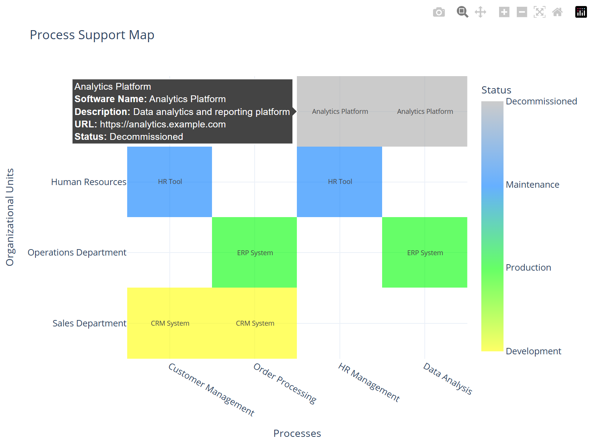

# Process Support Map Generator

This repository provides a [Python](https://www.python.org/)-based workflow to generate process support maps from an Excel file. The workflow involves converting Excel sheets to CSV files and then creating an interactive standalone HTML file using [Plotly](https://plotly.com/python/).



## Table of Contents
- [Process Support Map Generator](#process-support-map-generator)
  - [Table of Contents](#table-of-contents)
  - [Features](#features)
  - [Requirements](#requirements)
  - [Setup](#setup)
  - [Usage](#usage)
  - [License](#license)

---

## Features
- Converts Excel files into CSV format.
- Generates process support maps as standalone HTML files using Plotly for interactive visualization.
- Modular structure for easy integration and extension.

---

## Requirements
- Python 3.7 or newer
- Required Python packages are listed in the `requirements.txt` file.

- **Input Excel File**:  
  The workflow requires an Excel file named `process_map.xlsx` located in the `excel/` folder. This file must be structured as shown in the example file in the same folder. Specifically, the Excel file must include the following worksheets:

  - `software`: Contains information about the software components.
  - `processes`: Lists the processes relevant to the map.
  - `organizational_units`: Defines the organizational units involved.
  - `links`: Maps the relationships between the elements (e.g., software ↔ processes).

  Ensure the structure and data in the Excel file match the example file to avoid errors during execution.


---

## Setup
Follow these steps to set up the project environment and dependencies:

1. **Clone the repository**:
    ```bash
    git clone https://github.com/your-username/process-support-map.git
    cd process-support-map
    ```

2. **Create a virtual environment:**

    ```bash
    python -m venv venv
    ```

3. **Activate the virtual environment:**

   - **Windows:**
      ```bash
      .\venv\Scripts\activate
      ```

   - **macOS/Linux:**
      ```bash
      source venv/bin/activate
      ```

4. **Install dependencies:**

    ```bash
    pip install -r requirements.txt
    ```

---

## Usage

You can use the scripts either as standalone tools or as modules in a Python project.

1. **Run the entire workflow:**
Execute the `main.py` script to run the complete process:

    ```bash
    python main.py
    ```
You will find the output in the `dist/` directory.

2. **Use individual modules:**
You can also use the provided modules separately:

   - **Convert Excel to CSV:**

      ```python
      from excel_to_csv import convert_excel_to_csv
      
      input_excel_file = "excel/process_map.xlsx"
      output_csv_folder = "csv/"
      convert_excel_to_csv(input_excel_file, output_csv_folder)
      ```

   - **Generate Process Support Map:**

      ```python
      from generate_map import create_process_support_map

      create_process_support_map()
      ```

<!---
---

## Scientific Sources

The concept of process support maps originates from the field of software cartography in business informatics. Below are some relevant references:

1. [Source]

If you use this project in your research, please consider citing the above sources where appropriate.
--->

---

## License

This project is licensed under the [MIT License](https://opensource.org/license/mit). Feel free to use, modify, and distribute it as per the terms of the license.

